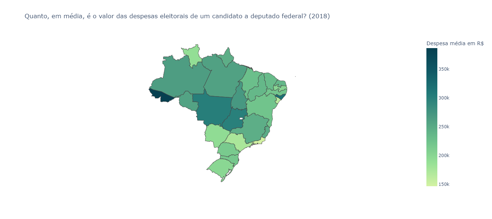
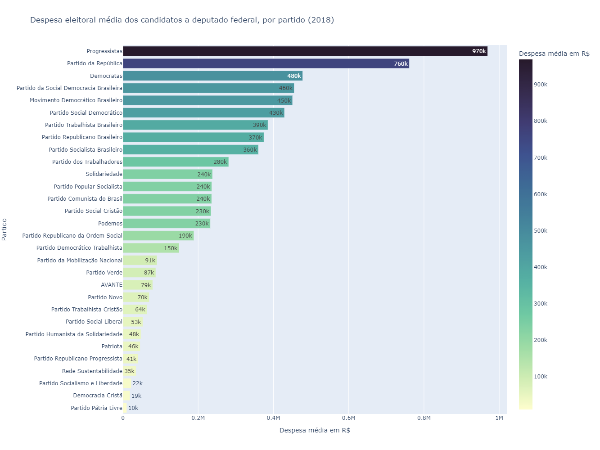
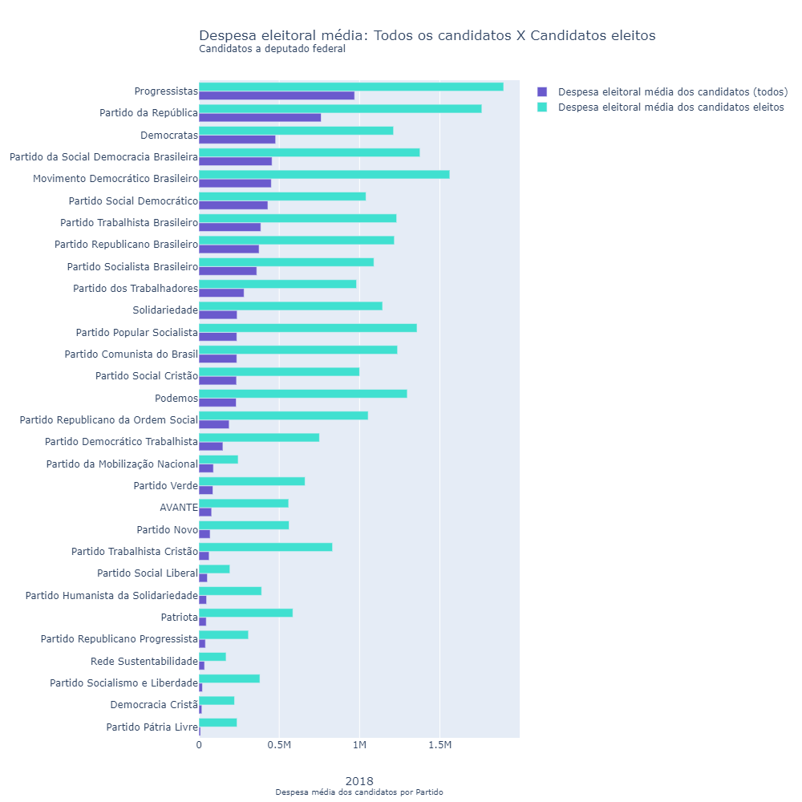
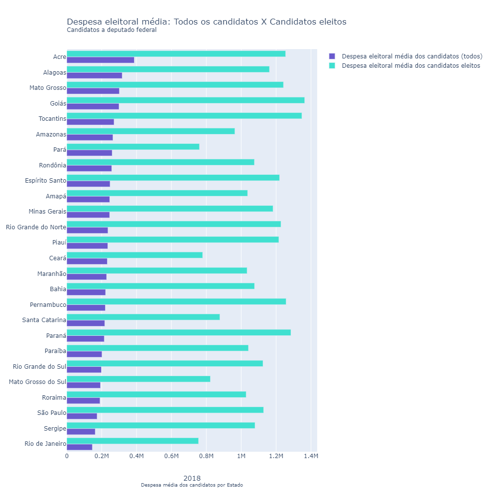

# Eleições Brasileiras: Despesas eleitorais dos candidatos a deputado federal (2018)

## Objetivo Geral: 
Analisar a despesa eleitoral média dos candidatos a deputado federal nas eleições federais de 2018. 
O foco é comparar as despesas eleitorais médias desses candidatos entre os estados e também entre os partidos.
Também é de interesse comparar a despesa eleitoral média geral dos candidatos a despesa eleitoral média dos candidatos eleitos,
por estado e por partido.

## Como usar

As visualizações já encontram-se geradas em html na pasta out, são:

* `map_uf`: Mapa com as despesas médias dos candidatos a deputado federal, por Estado (2018)
* `graf_partido`: Despesa média eleitoral dos candidatos a deputado federal, por partido (2018)
* `graf_comp_uf`: Comparação entre a despesa eleitoral média de todos os candidatos e dos candidatos eleitos, por estado (2018)
* `graf_comp_partido`: Comparação entre a despesa eleitoral média de todos os candidatos e dos candidatos eleitos, por partido (2018)

Estas visualizações foram geradas a partir dos dados em: 
* `out/data.json`, utilizando o script `src/treat_analysis_elections.py`

O arquivo data.json já se encontra versionado para utilização. 
Ele pode ser gerado utilizando script `src/get_data_elections.py`

## Dados utilizados

A fonte dos dados é do Tribunal Superior Eleitoral (TSE). Nesse projeto, foram utilizadas tabelas tratadas da organização [Basedosdados](https://basedosdados.org/dataset/br-tse-eleicoes) para o ano de 2018. O foco foi filtrar a análise nos deputados federais, utilizando as tabelas `basedosdados.br_tse_eleicoes.despesas_candidato` e `basedosdados.br_tse_eleicoes.resultados_candidato`. 

## Visualização

Obs: Para acessar todos os recursos das visualizações, abrí-las pelos arquivos html.

## Bibliotecas necessárias para o funcionamento do código: 

* [geopy](https://pypi.org/project/geopy/)
* [pandas](https://pypi.org/project/pandas/)
* [matplotlib](https://pypi.org/project/matplotlib/) 
* [plotly](https://pypi.org/project/plotly/)
* [basedosdados](https://pypi.org/project/basedosdados/)
* [ibge](https://pypi.org/project/ibge/)
